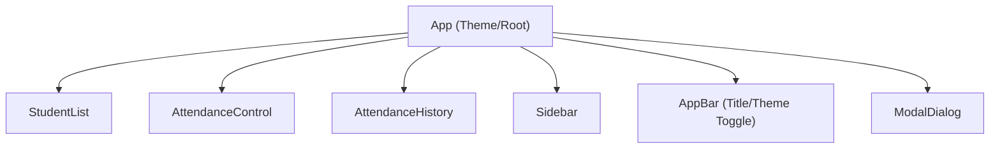

# Architectural Documentation: Attendance Frontend

## Overview

The Attendance Frontend is a React single-page application (SPA) designed for student attendance tracking. It prioritizes simplicity, ease of modification, and modern UI/UX practices. This document outlines the technical structure, key decisions, component design, data persistence, and theming.

## Technical Choices

- **Framework:** React (via Create React App)
- **Languages:** JavaScript (ES6+), CSS
- **Dependencies:** None beyond React and related tooling. No UI framework used; pure CSS styling.
- **Testing:** Uses Jest and React Testing Library (configured by default within Create React App).
- **Linting:** ESLint with React configuration.

## Key Architectural Elements

### Component Structure

At present, the application consists of a single main App component. More components will be added in the future to handle:
- Student list and management
- Attendance marking interface
- Attendance history and statistics
- Navigation/sidebar
- Modal dialogs and forms

#### src/index.js

- Bootstraps the React application.
- Mounts `<App />` into the DOM.

#### src/App.js

- Controls top-level application state (theme).
- Renders the main UI, including the theme toggle and branding.
- Applies the selected theme to the document's root element for CSS theming.

### Theming & Branding

- Uses CSS custom properties (variables) for easy brand adaptation and theme switching.
- Theme is persisted at runtime (not yet persisted to local storage but toggled in session).

Example CSS variables defined in `src/App.css`:
```css
:root {
  --bg-primary: #ffffff;
  --bg-secondary: #f8f9fa;
  --text-primary: #282c34;
  --text-secondary: #61dafb;
  --border-color: #e9ecef;
  --button-bg: #007bff;
  --button-text: #ffffff;
}
[data-theme="dark"] {
  --bg-primary: #1a1a1a;
  --bg-secondary: #282c34;
  --text-primary: #ffffff;
  --border-color: #404040;
  --button-bg: #0056b3;
  --button-text: #ffffff;
}
```

### Local Storage Usage

- **Planned:** Student data, attendance state, and system settings will be serialized to `window.localStorage`.
- **Current State:** As of now, only the theme state is managed at runtime (not using localStorage yet), but the architectural design foresees all core data models being stored in local storage.
- **Advantages:** No backend required, instant persistence, works offline.

#### Local Storage Design (Planned):

- Key: `students` → Array of student objects (name, id, metadata)
- Key: `attendance` → Map/dictionary of date-studentID:present/absent
- Key: `settings` → Theme, user preferences

### Container and File Structure

```
attendance_frontend/
  src/
    App.js
    App.css
    index.js
    index.css
    setupTests.js
  package.json
  README.md
  kavia-docs/
    PRD.md
    architecture.md
```

### Component/Container Interaction

At present, the App component controls all rendering and state, but the expected design is:


**Note:** Only `App` currently exists. The rest will be added as feature development proceeds.

---

## Summary

The Attendance Frontend is architected for growth: its core is a minimal, easily-extensible React skeleton using modern CSS variables for branding. Though only the basic App shell is complete, the structure anticipates robust student and attendance management, with persistent storage via localStorage.
